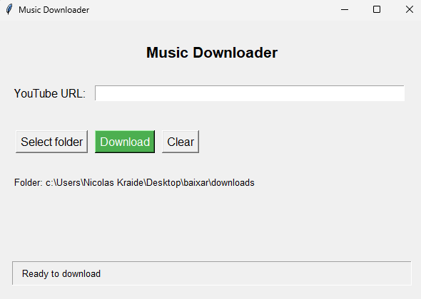

# 🎵 YouTube Music Downloader


A beautiful, user-friendly desktop application to download and convert YouTube videos to MP3 files. Get your favorite music with just a few clicks!

## ✨ Features

- 🔍 Simple and intuitive graphical user interface
- 🎧 High-quality MP3 conversion (192kbps)
- 📁 Custom download location selection
- 📊 Real-time download progress tracking
- ⚠️ Comprehensive error handling
- 🔄 Multi-threading to keep UI responsive during downloads

## 📋 Requirements

- Python 3.6+
- yt-dlp
- FFmpeg (for audio conversion)
- Tkinter (included with standard Python)

## 🚀 Installation

1. Clone this repository or download the `youtube_music_downloader.py` file.

2. Install the required dependencies:

```bash
pip install yt-dlp
```

3. Install FFmpeg:
   - **Windows:** Download from [ffmpeg.org](https://ffmpeg.org/download.html) and add to PATH
   - **macOS:** `brew install ffmpeg`
   - **Linux:** `sudo apt install ffmpeg`

## 💻 Usage

1. Run the application:

```bash
python youtube_music_downloader.py
```

2. Paste a YouTube URL into the input field.
3. Select your download folder (optional).
4. Click "Baixar" (Download) button.
5. Wait for the download and conversion to complete!

## 📷 Screenshots



*Main application window showing download in progress*

## 🛠️ How It Works

The application uses yt-dlp (an improved fork of youtube-dl) to download videos from YouTube and extract their audio. FFmpeg then converts the audio to MP3 format. The entire process runs in a separate thread to keep the UI responsive.

## ⚙️ Customization

You can modify these settings in the code:

- Audio quality (currently set to 192kbps)
- Output file naming format
- Default download directory

## 🤝 Contributing

Contributions are welcome! Feel free to submit pull requests or open issues to improve the application.

## 📜 License

This project is released under the MIT License.

---

Created with ❤️ by Nicolas Kraide
